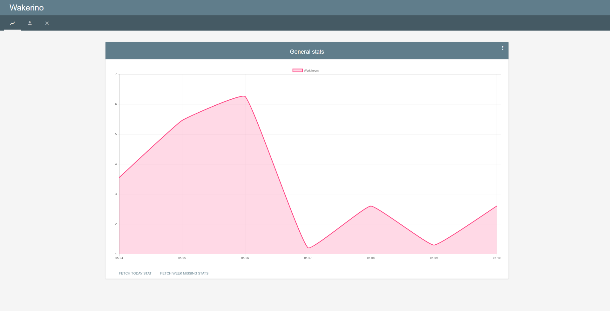

# Wakerino  

Wakerino is a web application built to improve time tracking management for programmers, like [WakaTime](https://wakatime.com/), but completely **FREE**. In fact, you can create a free account on WakaTime, but you can only view the stats about your last week's activities (for the complete stats you need a premium account).
Wakerino uses the WakaTime API for fetching your stats; it saves them on its server and presents them to you through its charts.



## What it is made of

Wakerino uses several frameworks and libraries from the web.

* Server-side: [Node.js](https://nodejs.org/en/) - [Express](http://expressjs.com/) - [MongoDB](https://www.mongodb.com/)  
* Client-side: [AngularJS](https://angularjs.org/) - [Material Design Lite](http://materializecss.com/) - [Chart.js](http://www.chartjs.org/) 

## Prerequisites

Make sure you have installed all of the following prerequisites on your machine.

* Download and install Node.js from http://www.nodejs.org/download/ and the npm package manager.
* Download and install MongoDB from http://www.mongodb.org/downloads and make sure it is running on the default port 27017.

## Installation

To install Wakerino's dependencies you are going to use npm. In the application root folder run this in the command-line:

```bash
$ npm install
```

On file _config.json_ replace secret string.

```
"secret": "REPLACE THIS WITH YOUR OWN SECRET, IT CAN BE ANY STRING"
```

## Running Wakerino locally

After the install process is over, you'll be able to run Wakerino using npm, just run:

```
$ npm start
```

Wakerino will be running on port 3000, just open your browser and visit [localhost:3000](http://localhost:3000).


## Running Wakerino in a server

In order to run Wakerino on a server, npm module [forever](https://www.npmjs.com/package/forever) is required. Run this in the command line:

```bash
$ [sudo] npm install -g forever
```

Then go to application root folder and run:

```bash
$ forever start server.js
```

Now Wakerino is running on server port 3000.


## Configuration

Wakerino uses WakaTime's plugins and API; first of all, you need to complete these initial steps.

- Create an account on WakaTime ( https://wakatime.com/signup );
- Log into your WakaTime account and go into account/settings ( https://wakatime.com/settings/account );
- Save your secret Key;
- Install WakaTime's plugin on your text editor with this guide ( https://wakatime.com/editors ).

When you are finished configuring WakaTime, visit [Wakerino](http://localhost:3000) and create a new account. 
Insert the WakaTime's secret key previously saved in the _ApiKey_ field; the system will then register the new account and retrieve the last week of statistics.
Proceed with the authentication and enjoy!


## Something you have to know

- The first version of Wakerino provides a simple chart that shows the total hours you spent programming on each day;
- Every day at 23.55, server automatically fetches the stats of the day for all registered users;
- You can only retrieve your last week's stats whenever you manually retrieve your information from WakaTime.
 
 
## ToDo

- [ ] More detailed charts with custom ranges of dates
- [ ] Add the feature to retrieve the complete stats if you're a premium user of WakaTime
- [ ] Team's stats
- [ ] Tests


## Thanks
I would say thanks to:
- [enron92](https://github.com/enron92) for the talks, during lessons, about this little project;
- [FMeneguzzo](https://github.com/FMeneguzzo) for having clarified some of my doubts and checked my bad English.

## License

Wakerino's source code is released under [GNU AGPLv3 License](http://www.gnu.org/licenses/agpl-3.0.html).

> Wakerino
>
> Copyright (C) 2016 Mattia Favaron
>
> This program is free software: you can redistribute it and/or modify
> it under the terms of the GNU Affero General Public License as
> published by the Free Software Foundation, either version 3 of the
> License, or (at your option) any later version.
>
> This program is distributed in the hope that it will be useful,
> but WITHOUT ANY WARRANTY; without even the implied warranty of
> MERCHANTABILITY or FITNESS FOR A PARTICULAR PURPOSE. See the
> GNU Affero General Public License for more details.
>
> You should have received a copy of the GNU Affero General Public License
> along with this program. If not, see http://www.gnu.org/licenses/.